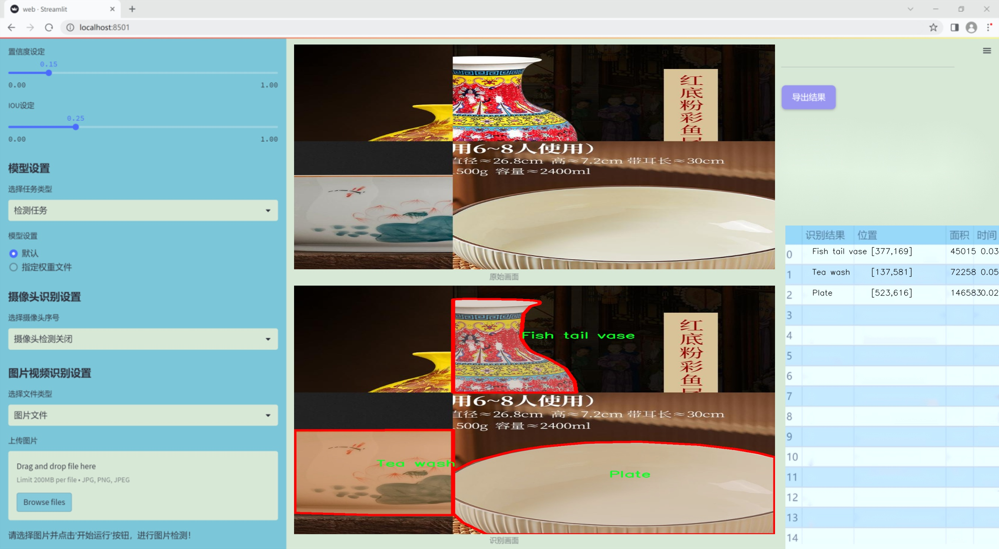
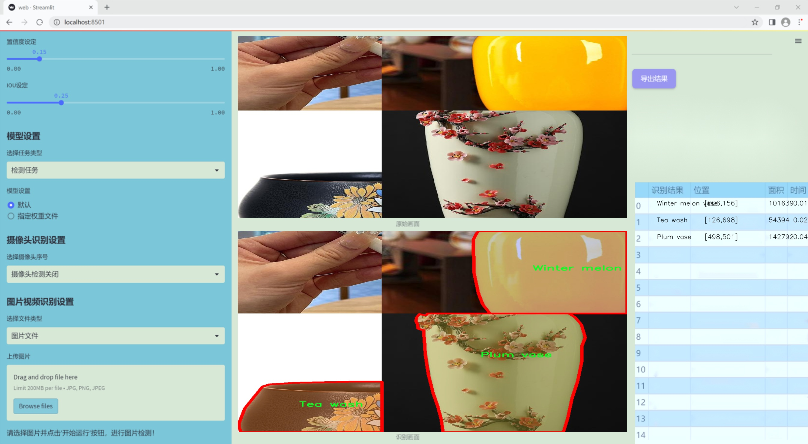
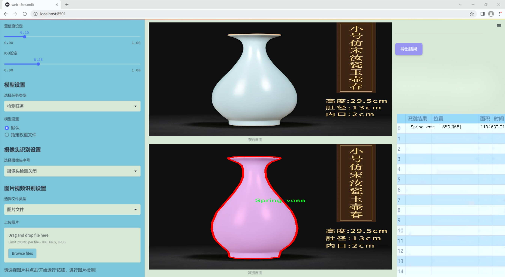
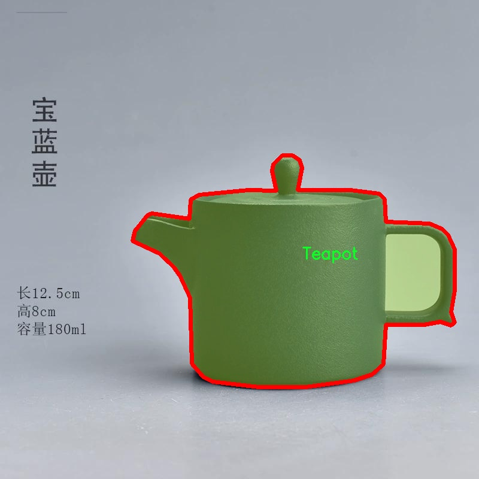
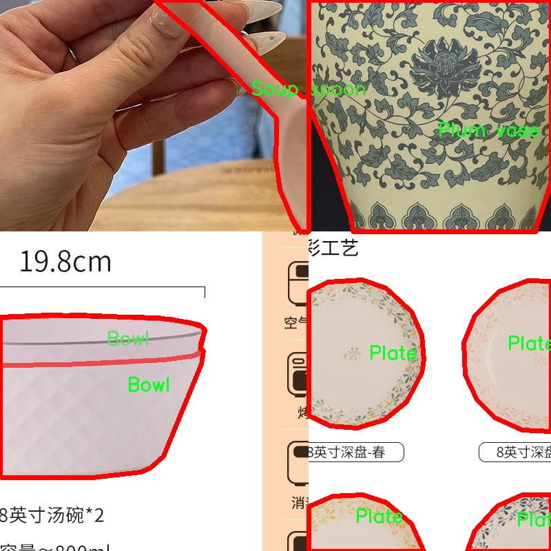
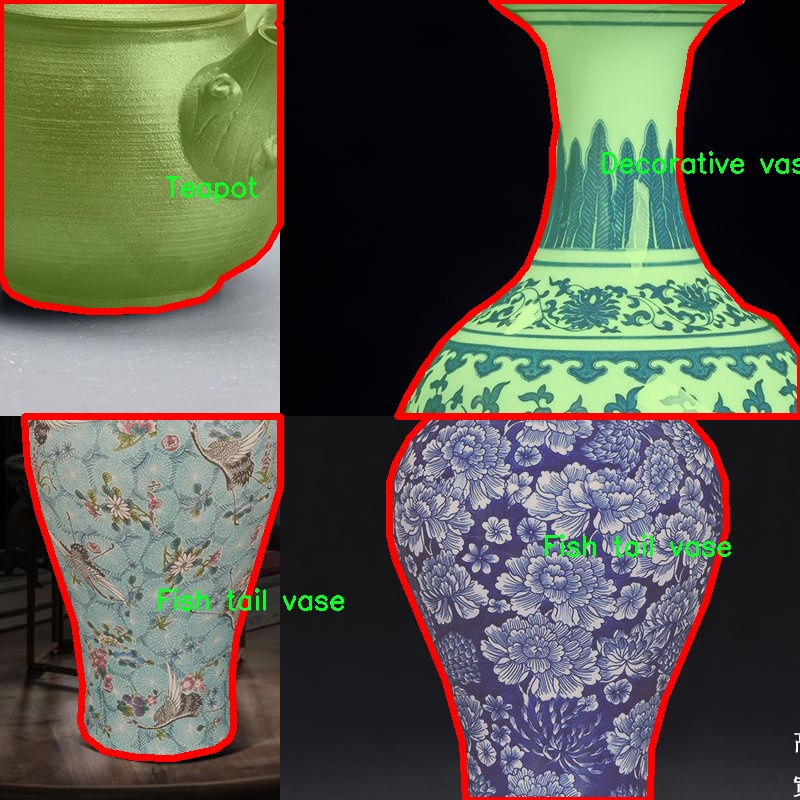
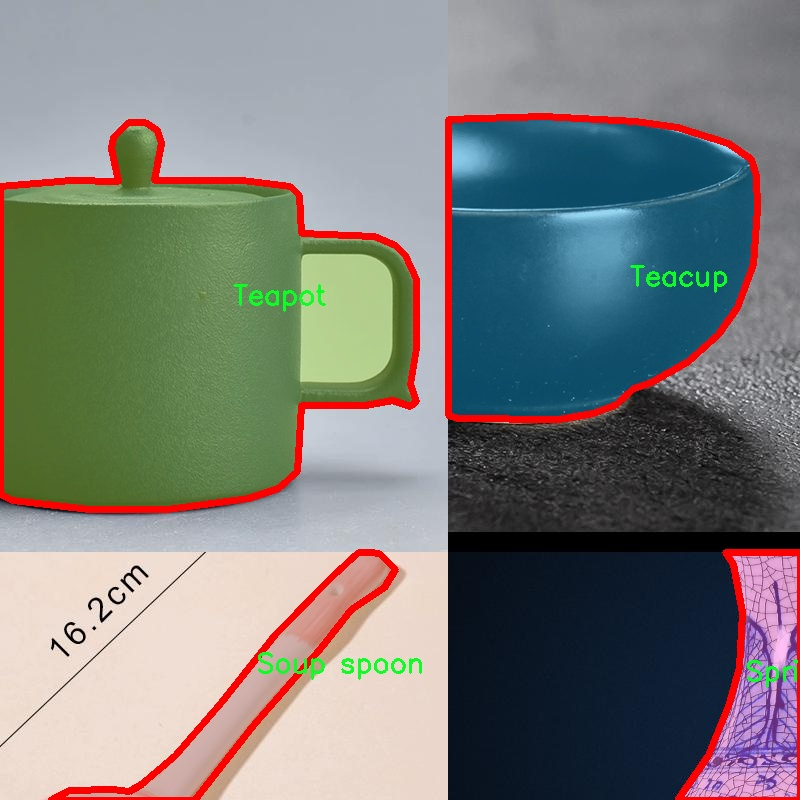
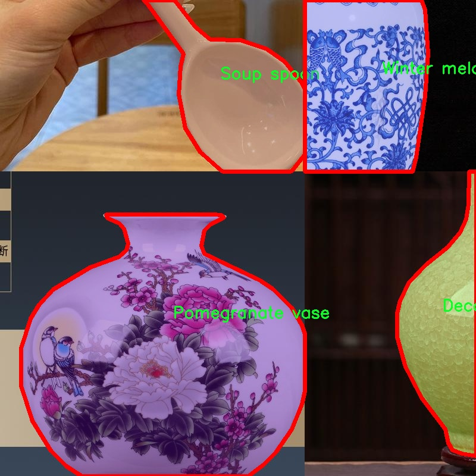

### 1.背景意义

研究背景与意义

随着科技的不断进步，计算机视觉技术在各个领域的应用愈发广泛，尤其是在物品识别和实例分割方面。陶瓷艺术作为一种传统工艺，不仅承载着丰富的文化内涵，也在现代生活中占据了重要的地位。陶瓷物品的多样性和复杂性使得其在图像识别和分割中面临诸多挑战。因此，开发一个高效的陶瓷物品实例分割系统，不仅有助于提升计算机视觉技术在艺术品领域的应用，也为陶瓷产业的数字化转型提供了新的思路。

本研究旨在基于改进的YOLOv11模型，构建一个针对陶瓷物品的实例分割系统。该系统将使用包含1300张图像的陶瓷数据集，涵盖13个类别，包括碗、装饰花瓶、鱼尾花瓶、盘子等。这些类别的多样性为模型的训练提供了丰富的样本，有助于提高模型的泛化能力和识别精度。通过对数据集的深入分析和处理，结合YOLOv11的高效性和准确性，期望能够实现对陶瓷物品的精确分割和识别。

此外，陶瓷物品的实例分割不仅在艺术品鉴定、市场分析等领域具有重要意义，也为智能家居、虚拟现实等新兴应用提供了技术支持。通过将传统陶瓷与现代科技相结合，本研究不仅推动了计算机视觉技术的发展，也为陶瓷文化的传播和保护提供了新的工具和方法。因此，基于改进YOLOv11的陶瓷物品实例分割系统的研究，具有重要的学术价值和实际应用意义。

### 2.视频效果

[2.1 视频效果](https://www.bilibili.com/video/BV1mSqGYmE7z/)

### 3.图片效果







##### [项目涉及的源码数据来源链接](https://kdocs.cn/l/cszuIiCKVNis)**

注意：本项目提供训练的数据集和训练教程,由于版本持续更新,暂不提供权重文件（best.pt）,请按照6.训练教程进行训练后实现上图演示的效果。

### 4.数据集信息

##### 4.1 本项目数据集类别数＆类别名

nc: 13
names: ['Bowl', 'Decorative vase', 'Fish tail vase', 'Plate', 'Plum vase', 'Pomegranate vase', 'Soup spoon', 'Spring vase', 'Tea wash', 'Teacup', 'Teapot', 'Water glass', 'Winter melon vase']


该项目为【图像分割】数据集，请在【训练教程和Web端加载模型教程（第三步）】这一步的时候按照【图像分割】部分的教程来训练

##### 4.2 本项目数据集信息介绍

本项目数据集信息介绍

本项目旨在改进YOLOv11的陶瓷物品实例分割系统，所使用的数据集主题为“ceramics 2”。该数据集专注于多种陶瓷物品的识别与分割，包含13个不同的类别，涵盖了广泛的陶瓷制品。这些类别包括：碗（Bowl）、装饰花瓶（Decorative vase）、鱼尾花瓶（Fish tail vase）、盘子（Plate）、梅花花瓶（Plum vase）、石榴花瓶（Pomegranate vase）、汤勺（Soup spoon）、春季花瓶（Spring vase）、茶洗（Tea wash）、茶杯（Teacup）、茶壶（Teapot）、水杯（Water glass）以及冬瓜花瓶（Winter melon vase）。这些类别的选择不仅反映了陶瓷艺术的多样性，也为模型的训练提供了丰富的样本。

数据集中的每个类别均包含大量的图像，确保了模型在训练过程中能够接触到不同形状、颜色和纹理的陶瓷物品。这种多样性对于提高模型的泛化能力至关重要，使其能够在实际应用中更准确地识别和分割各种陶瓷物品。此外，数据集中的图像经过精心标注，确保每个物品的边界清晰可见，为实例分割任务提供了可靠的基础。

通过对“ceramics 2”数据集的深入分析和应用，我们期望能够提升YOLOv11在陶瓷物品实例分割方面的性能，进而推动相关领域的研究与应用。无论是在艺术品鉴定、陶瓷产品的自动化分类，还是在文化遗产保护中，这一改进都将具有重要的实际意义。











### 5.全套项目环境部署视频教程（零基础手把手教学）

[5.1 所需软件PyCharm和Anaconda安装教程（第一步）](https://www.bilibili.com/video/BV1BoC1YCEKi/?spm_id_from=333.999.0.0&vd_source=bc9aec86d164b67a7004b996143742dc)


[5.2 安装Python虚拟环境创建和依赖库安装视频教程（第二步）](https://www.bilibili.com/video/BV1ZoC1YCEBw?spm_id_from=333.788.videopod.sections&vd_source=bc9aec86d164b67a7004b996143742dc)

### 6.改进YOLOv11训练教程和Web_UI前端加载模型教程（零基础手把手教学）

[6.1 改进YOLOv11训练教程和Web_UI前端加载模型教程（第三步）](https://www.bilibili.com/video/BV1BoC1YCEhR?spm_id_from=333.788.videopod.sections&vd_source=bc9aec86d164b67a7004b996143742dc)


按照上面的训练视频教程链接加载项目提供的数据集，运行train.py即可开始训练



     Epoch   gpu_mem       box       obj       cls    labels  img_size
     1/200     20.8G   0.01576   0.01955  0.007536        22      1280: 100%|██████████| 849/849 [14:42<00:00,  1.04s/it]
               Class     Images     Labels          P          R     mAP@.5 mAP@.5:.95: 100%|██████████| 213/213 [01:14<00:00,  2.87it/s]
                 all       3395      17314      0.994      0.957      0.0957      0.0843

     Epoch   gpu_mem       box       obj       cls    labels  img_size
     2/200     20.8G   0.01578   0.01923  0.007006        22      1280: 100%|██████████| 849/849 [14:44<00:00,  1.04s/it]
               Class     Images     Labels          P          R     mAP@.5 mAP@.5:.95: 100%|██████████| 213/213 [01:12<00:00,  2.95it/s]
                 all       3395      17314      0.996      0.956      0.0957      0.0845

     Epoch   gpu_mem       box       obj       cls    labels  img_size
     3/200     20.8G   0.01561    0.0191  0.006895        27      1280: 100%|██████████| 849/849 [10:56<00:00,  1.29it/s]
               Class     Images     Labels          P          R     mAP@.5 mAP@.5:.95: 100%|███████   | 187/213 [00:52<00:00,  4.04it/s]
                 all       3395      17314      0.996      0.957      0.0957      0.0845


###### [项目数据集下载链接](https://kdocs.cn/l/cszuIiCKVNis)

### 7.原始YOLOv11算法讲解

YOLOv11是一种由Ultralytics公司开发的最新一代目标检测模型，以其增强的特征提取能力和更高的效率在计算机视觉领域引人注目。该模型在架构上进行了关键升级，通过更新主干和颈部结构，显著提高了对复杂视觉场景的理解和处理精度。YOLOv11不仅在目标检测上表现出色，还支持实例分割、图像分类、姿态估计和定向目标检测（OBB）等任务，展示出其多功能性。

与其前身YOLOv8相比，YOLOv11在设计上实现了深度和宽度的改变，同时引入了几个创新机制。其中，C3k2机制是对YOLOv8中的C2f的改进，提升了浅层特征的处理能力；C2PSA机制则进一步优化了特征图的处理流程。解耦头的创新设计，通过增加两个深度卷积（DWConv），提高了模型对细节的感知能力和分类准确性。

在性能上，YOLOv11m模型在COCO数据集上的平均精度（mAP）提高，并减少了22%的参数量，确保了在运算效率上的突破。该模型可以部署在多种平台上，包括边缘设备、云平台以及支持NVIDIA GPU的系统，彰显出卓越的灵活性和适应性。总体而言，YOLOv11通过一系列的创新突破，对目标检测领域产生了深远的影响，并为未来的开发提供了新的研究方向。


****文档**** ： _ _https://docs.ultralytics.com/models/yolo11/__

****代码链接**** ： _ _https://github.com/ultralytics/ultralytics__

******Performance Metrics******


​ ** **关键特性****

****◆**** ** **增强的特征提取能力**** ：YOLO11采用了改进的主干和颈部架构，增强了 ** **特征提取****
能力，能够实现更精确的目标检测和复杂任务的执行。

****◆**** ** **优化的效率和速度****
：YOLO11引入了精细化的架构设计和优化的训练流程，提供更快的处理速度，并在准确性和性能之间保持最佳平衡。

****◆**** ** **参数更少、精度更高****
：通过模型设计的改进，YOLO11m在COCO数据集上实现了更高的平均精度（mAP），同时使用的参数比YOLOv8m少22%，使其在计算上更加高效，而不牺牲准确性。

****◆**** ** **跨环境的适应性**** ：YOLO11可以无缝部署在各种环境中，包括边缘设备、云平台和支持NVIDIA
GPU的系统，确保最大的灵活性。

****◆**** ** **支持广泛任务****
：无论是目标检测、实例分割、图像分类、姿态估计还是定向目标检测（OBB），YOLO11都旨在应对一系列计算机视觉挑战。

****支持的任务和模式****


​YOLO11建立在YOLOv8中引入的多功能模型范围之上，为各种计算机视觉任务提供增强的支持:


​该表提供了YOLO11模型变体的概述，展示了它们在特定任务中的适用性以及与Inference、Validation、Training和Export等操作模式的兼容性。从实时检测到复杂的分割任务
，这种灵活性使YOLO11适用于计算机视觉的广泛应用。

##### yolov11的创新

■ yolov8 VS yolov11

YOLOv5，YOLOv8和YOLOv11均是ultralytics公司的作品，ultralytics出品必属精品。


​ **具体创新点** ：

**① 深度（depth）和宽度 （width）**

YOLOv8和YOLOv11是基本上完全不同。

**② C3k2机制**

C3k2有参数为c3k，其中在网络的浅层c3k设置为False。C3k2就相当于YOLOv8中的C2f。


​ **③ C2PSA机制**

下图为C2PSA机制的原理图。


​ **④ 解耦头**

解耦头中的分类检测头增加了两个 **DWConv** 。


▲Conv

    
    
    def autopad(k, p=None, d=1):  # kernel, padding, dilation
    
        """Pad to 'same' shape outputs."""
    
        if d > 1:
    
            k = d * (k - 1) + 1 if isinstance(k, int) else [d * (x - 1) + 1 for x in k]  # actual kernel-size
    
        if p is None:
    
            p = k // 2 if isinstance(k, int) else [x // 2 for x in k]  # auto-pad
    
    return p
    
    
    class Conv(nn.Module):
    
        """Standard convolution with args(ch_in, ch_out, kernel, stride, padding, groups, dilation, activation)."""
    
    
        default_act = nn.SiLU()  # default activation
    
    
        def __init__(self, c1, c2, k=1, s=1, p=None, g=1, d=1, act=True):
    
            """Initialize Conv layer with given arguments including activation."""
    
            super().__init__()
    
            self.conv = nn.Conv2d(c1, c2, k, s, autopad(k, p, d), groups=g, dilation=d, bias=False)
    
            self.bn = nn.BatchNorm2d(c2)
    
            self.act = self.default_act if act is True else act if isinstance(act, nn.Module) else nn.Identity()
    
    
        def forward(self, x):
    
            """Apply convolution, batch normalization and activation to input tensor."""
    
            return self.act(self.bn(self.conv(x)))
    
    
        def forward_fuse(self, x):
    
            """Perform transposed convolution of 2D data."""
    
            return self.act(self.conv(x))

▲Conv2d

    
    
    torch.nn.Conv2d(in_channels, out_channels, kernel_size, stride=1, padding=0, dilation=1, groups=1, bias=True, padding_mode='zeros')

▲DWConv

DWConv ** **代表 Depthwise Convolution（深度卷积）****
，是一种在卷积神经网络中常用的高效卷积操作。它主要用于减少计算复杂度和参数量。

    
    
    class DWConv(Conv):
    
        """Depth-wise convolution."""
    
    
        def __init__(self, c1, c2, k=1, s=1, d=1, act=True):  # ch_in, ch_out, kernel, stride, dilation, activation
    
            """Initialize Depth-wise convolution with given parameters."""
    
            super().__init__(c1, c2, k, s, g=math.gcd(c1, c2), d=d, act=act)


### 8.200+种全套改进YOLOV11创新点原理讲解

#### 8.1 200+种全套改进YOLOV11创新点原理讲解大全

由于篇幅限制，每个创新点的具体原理讲解就不全部展开，具体见下列网址中的改进模块对应项目的技术原理博客网址【Blog】（创新点均为模块化搭建，原理适配YOLOv5~YOLOv11等各种版本）

[改进模块技术原理博客【Blog】网址链接](https://gitee.com/qunmasj/good)


#### 8.2 精选部分改进YOLOV11创新点原理讲解

###### 这里节选部分改进创新点展开原理讲解(完整的改进原理见上图和[改进模块技术原理博客链接](https://gitee.com/qunmasj/good)【如果此小节的图加载失败可以通过CSDN或者Github搜索该博客的标题访问原始博客，原始博客图片显示正常】



### 视觉transformer(ViT)简介
视觉transformer(ViT)最近在各种计算机视觉任务中证明了巨大的成功，并受到了相当多的关注。与卷积神经网络(CNNs)相比，ViT具有更强的全局信息捕获能力和远程交互能力，表现出优于CNNs的准确性，特别是在扩大训练数据大小和模型大小时[An image is worth 16x16 words: Transformers for image recognition at scale,Coatnet]。

尽管ViT在低分辨率和高计算领域取得了巨大成功，但在高分辨率和低计算场景下，ViT仍不如cnn。例如，下图(左)比较了COCO数据集上当前基于cnn和基于vit的一级检测器。基于vit的检测器(160G mac)和基于cnn的检测器(6G mac)之间的效率差距超过一个数量级。这阻碍了在边缘设备的实时高分辨率视觉应用程序上部署ViT。


左图:现有的基于vit的一级检测器在实时目标检测方面仍然不如当前基于cnn的一级检测器，需要的计算量多出一个数量级。本文引入了第一个基于vit的实时对象检测器来弥补这一差距。在COCO上，efficientvit的AP比efficientdet高3.8，而mac较低。与YoloX相比，efficient ViT节省67.2%的计算成本，同时提供更高的AP。

中:随着输入分辨率的增加，计算成本呈二次增长，无法有效处理高分辨率的视觉应用。

右图:高分辨率对图像分割很重要。当输入分辨率从1024x2048降低到512x1024时，MobileNetV2的mIoU减少12% (8.5 mIoU)。在不提高分辨率的情况下，只提高模型尺寸是无法缩小性能差距的。

ViT的根本计算瓶颈是softmax注意模块，其计算成本随输入分辨率的增加呈二次增长。例如，如上图(中)所示，随着输入分辨率的增加，vit- small[Pytorch image models. https://github.com/rwightman/ pytorch-image-models]的计算成本迅速显著大于ResNet-152的计算成本。

解决这个问题的一个直接方法是降低输入分辨率。然而，高分辨率的视觉识别在许多现实世界的计算机视觉应用中是必不可少的，如自动驾驶，医疗图像处理等。当输入分辨率降低时，图像中的小物体和精细细节会消失，导致目标检测和语义分割性能显著下降。

上图(右)显示了在cityscape数据集上不同输入分辨率和宽度乘法器下MobileNetV2的性能。例如，将输入分辨率从1024x2048降低到512x1024会使cityscape的性能降低12% (8.5 mIoU)。即使是3.6倍高的mac，只放大模型尺寸而不增加分辨率也无法弥补这一性能损失。

除了降低分辨率外，另一种代表性的方法是限制softmax注意，方法是将其范围限制在固定大小的局部窗口内[Swin transformer,Swin transformer v2]或降低键/值张量的维数[Pyramid vision transformer,Segformer]。然而，它损害了ViT的非局部注意能力，降低了全局接受域(ViT最重要的优点)，使得ViT与大内核cnn的区别更小[A convnet for the 2020s,Scaling up your kernels to 31x31: Revisiting large kernel design in cnns,Lite pose: Efficient architecture design for 2d human pose estimation]。

本文介绍了一个有效的ViT体系结构，以解决这些挑战。发现没有必要坚持softmax注意力。本文建议用线性注意[Transformers are rnns: Fast autoregressive transformers with linear attention]代替softmax注意。

线性注意的关键好处是，它保持了完整的n 2 n^2n 2
 注意映射，就像softmax注意。同时，它利用矩阵乘法的联想特性，避免显式计算完整的注意映射，同时保持相同的功能。因此，它保持了softmax注意力的全局特征提取能力，且计算复杂度仅为线性。线性注意的另一个关键优点是它避免了softmax，这使得它在移动设备上更有效(下图左)。


左图:线性注意比类似mac下的softmax注意快3.3-4.5倍，这是因为去掉了硬件效率不高的softmax功能。延迟是在Qualcomm Snapdragon 855 CPU和TensorFlow-Lite上测量的。本文增加线性注意的头部数量，以确保它具有与softmax注意相似的mac。

中:然而，如果没有softmax注意中使用的非线性注意评分归一化，线性注意无法有效集中其注意分布，削弱了其局部特征提取能力。后文提供了可视化。

右图:本文用深度卷积增强线性注意，以解决线性注意的局限性。深度卷积可以有效地捕捉局部特征，而线性注意可以专注于捕捉全局信息。增强的线性注意在保持线性注意的效率和简单性的同时，表现出在各种视觉任务上的强大表现(图4)。

然而，直接应用线性注意也有缺点。以往的研究表明线性注意和softmax注意之间存在显著的性能差距(下图中间)。


左:高通骁龙855上的精度和延迟权衡。效率vit比效率网快3倍，精度更高。中:ImageNet上softmax注意与线性注意的比较。在相同的计算条件下，本文观察到softmax注意与线性注意之间存在显著的精度差距。而深度卷积增强模型后，线性注意的精度有明显提高。

相比之下，softmax注意的精度变化不大。在相同MAC约束下，增强线性注意比增强软最大注意提高了0.3%的精度。右图:与增强的softmax注意相比，增强的线性注意硬件效率更高，随着分辨率的增加，延迟增长更慢。

深入研究线性注意和softmax注意的详细公式，一个关键的区别是线性注意缺乏非线性注意评分归一化方案。这使得线性注意无法有效地将注意力分布集中在局部模式产生的高注意分数上，从而削弱了其局部特征提取能力。

本文认为这是线性注意的主要限制，使其性能不如softmax注意。本文提出了一个简单而有效的解决方案来解决这一限制，同时保持线性注意在低复杂度和低硬件延迟方面的优势。具体来说，本文建议通过在每个FFN层中插入额外的深度卷积来增强线性注意。因此，本文不需要依赖线性注意进行局部特征提取，避免了线性注意在捕捉局部特征方面的不足，并利用了线性注意在捕捉全局特征方面的优势。

本文广泛评估了efficient vit在低计算预算下对各种视觉任务的有效性，包括COCO对象检测、城市景观语义分割和ImageNet分类。本文想要突出高效的主干设计，所以没有包括任何正交的附加技术(例如，知识蒸馏，神经架构搜索)。尽管如此，在COCO val2017上，efficientvit的AP比efficientdet - d1高2.4倍，同时节省27.9%的计算成本。在cityscape上，efficientvit提供了比SegFormer高2.5个mIoU，同时降低了69.6%的计算成本。在ImageNet上，efficientvit在584M mac上实现了79.7%的top1精度，优于efficientnet - b1的精度，同时节省了16.6%的计算成本。

与现有的以减少参数大小或mac为目标的移动ViT模型[Mobile-former,Mobilevit,NASVit]不同，本文的目标是减少移动设备上的延迟。本文的模型不涉及复杂的依赖或硬件低效操作。因此，本文减少的计算成本可以很容易地转化为移动设备上的延迟减少。

在高通骁龙855 CPU上，efficient vit运行速度比efficientnet快3倍，同时提供更高的ImageNet精度。本文的代码和预训练的模型将在出版后向公众发布。

### Efficient Vision Transformer.
提高ViT的效率对于在资源受限的边缘平台上部署ViT至关重要，如手机、物联网设备等。尽管ViT在高计算区域提供了令人印象深刻的性能，但在针对低计算区域时，它通常不如以前高效的cnn[Efficientnet, mobilenetv3,Once for all: Train one network and specialize it for efficient deployment]。为了缩小差距，MobileViT建议结合CNN和ViT的长处，使用transformer将卷积中的局部处理替换为全局处理。MobileFormer提出了在MobileNet和Transformer之间建立双向桥以实现特征融合的并行化。NASViT提出利用神经架构搜索来搜索高效的ViT架构。

这些模型在ImageNet上提供了极具竞争力的准确性和效率的权衡。然而，它们并不适合高分辨率的视觉任务，因为它们仍然依赖于softmax注意力。


在本节中，本文首先回顾了自然语言处理中的线性注意，并讨论了它的优缺点。接下来，本文介绍了一个简单而有效的解决方案来克服线性注意的局限性。最后，给出了efficient vit的详细架构。

 为可学习投影矩阵。Oi表示矩阵O的第i行。Sim(·，·)为相似度函数。

虽然softmax注意力在视觉和NLP方面非常成功，但它并不是唯一的选择。例如，线性注意提出了如下相似度函数:


其中，φ(·)为核函数。在本工作中，本文选择了ReLU作为内核函数，因为它对硬件来说是友好的。当Sim(Q, K) = φ(Q)φ(K)T时，式(1)可改写为:


线性注意的一个关键优点是，它允许利用矩阵乘法的结合律，在不改变功能的情况下，将计算复杂度从二次型降低到线性型:


除了线性复杂度之外，线性注意的另一个关键优点是它不涉及注意模块中的softmax。Softmax在硬件上效率非常低。避免它可以显著减少延迟。例如，下图(左)显示了softmax注意和线性注意之间的延迟比较。在类似的mac上，线性注意力比移动设备上的softmax注意力要快得多。


#### EfficientViT
Enhancing Linear Attention with Depthwise Convolution

虽然线性注意在计算复杂度和硬件延迟方面优于softmax注意，但线性注意也有局限性。以往的研究[\[Luna: Linear unified nested attention,Random feature attention,Combiner: Full attention transformer with sparse computation cost,cosformer: Rethinking softmax in attention\]](https://afdian.net/item/602b9612927111ee9ec55254001e7c00)表明，在NLP中线性注意和softmax注意之间通常存在显著的性能差距。对于视觉任务，之前的研究[Visual correspondence hallucination,Quadtree attention for vision transformers]也表明线性注意不如softmax注意。在本文的实验中，本文也有类似的观察结果(图中)。


本文对这一假设提出了质疑，认为线性注意的低劣性能主要是由于局部特征提取能力的丧失。如果没有在softmax注意中使用的非线性评分归一化，线性注意很难像softmax注意那样集中其注意分布。下图(中间)提供了这种差异的示例。


在相同的原始注意力得分下，使用softmax比不使用softmax更能集中注意力。因此，线性注意不能有效地聚焦于局部模式产生的高注意分数(下图)，削弱了其局部特征提取能力。


注意图的可视化显示了线性注意的局限性。通过非线性注意归一化，softmax注意可以产生清晰的注意分布，如中间行所示。相比之下，线性注意的分布相对平滑，使得线性注意在捕捉局部细节方面的能力较弱，造成了显著的精度损失。本文通过深度卷积增强线性注意来解决这一限制，并有效提高了准确性。

介绍了一个简单而有效的解决方案来解决这个限制。本文的想法是用卷积增强线性注意，这在局部特征提取中是非常有效的。这样，本文就不需要依赖于线性注意来捕捉局部特征，而可以专注于全局特征提取。具体来说，为了保持线性注意的效率和简单性，本文建议在每个FFN层中插入一个深度卷积，这样计算开销很小，同时极大地提高了线性注意的局部特征提取能力。

#### Building Block

下图(右)展示了增强线性注意的详细架构，它包括一个线性注意层和一个FFN层，在FFN的中间插入深度卷积。


与之前的方法[Swin transformer,Coatnet]不同，本文在efficientvit中没有使用相对位置偏差。相对位置偏差虽然可以改善模型的性能，但它使模型容易受到分辨率变化[Segformer]的影响。多分辨率训练或新分辨率下的测试在检测和分割中很常见。去除相对位置偏差使高效率vit对输入分辨率更加灵活。

与之前低计算CNNs[Mobilenetv2,mobilenetv3]的设计不同，本文为下采样块添加了额外的下采样快捷方式。每个下采样快捷方式由一个平均池和一个1x1卷积组成。在本文的实验中，这些额外的下采样快捷方式可以稳定训练效率，提高性能。

#### Macro Architecture

下图说明了efficientvit的宏观体系结构。它由输入 stem 和4级组成。最近的研究[Coatnet,Levit,Early convolutions help transformers see better]表明在早期阶段使用卷积对ViT更好。本文遵循这个设计，在第三阶段开始使用增强的线性注意。


EfficientViT宏观架构。本文从第三阶段开始使用增强的线性注意。P2、P3和P4形成了一个金字塔特征图，用于检测和分割。P4用于分类。

为了突出高效的主干本身，本文对MBConv和FFN使用相同的扩展比e (e = 4)保持超参数简单，对所有深度卷积使用相同的内核大小k(除了输入stem)，对所有层使用相同的激活函数(hard swish)。

P2、P3和P4表示阶段2、3和4的输出，形成了特征图的金字塔。本文按照惯例将P2、P3和P4送至检测头。本文使用Yolov8进行检测。为了分割，本文融合了P2和P4。融合特征被馈送到一个轻量级头，包括几个卷积层，遵循Fast-SCNN。为了分类，本文将P4输入到轻量级头部，与MobileNetV3相同。


### 9.系统功能展示

图9.1.系统支持检测结果表格显示

  图9.2.系统支持置信度和IOU阈值手动调节

  图9.3.系统支持自定义加载权重文件best.pt(需要你通过步骤5中训练获得)

  图9.4.系统支持摄像头实时识别

  图9.5.系统支持图片识别

  图9.6.系统支持视频识别

  图9.7.系统支持识别结果文件自动保存

  图9.8.系统支持Excel导出检测结果数据


### 10. YOLOv11核心改进源码讲解

#### 10.1 deconv.py

以下是代码中最核心的部分，保留了必要的功能和结构，并添加了详细的中文注释：

```python
import math
import torch
from torch import nn
from einops.layers.torch import Rearrange

# 定义一个卷积层类，带有特定的权重获取方式
class Conv2d_cd(nn.Module):
    def __init__(self, in_channels, out_channels, kernel_size=3, stride=1,
                 padding=1, dilation=1, groups=1, bias=False, theta=1.0):
        super(Conv2d_cd, self).__init__()
        # 初始化常规卷积层
        self.conv = nn.Conv2d(in_channels, out_channels, kernel_size=kernel_size, stride=stride, padding=padding, dilation=dilation, groups=groups, bias=bias)
        self.theta = theta  # 用于调整权重的参数

    def get_weight(self):
        # 获取卷积层的权重
        conv_weight = self.conv.weight
        conv_shape = conv_weight.shape
        # 重排权重的形状
        conv_weight = Rearrange('c_in c_out k1 k2 -> c_in c_out (k1 k2)')(conv_weight)
        # 创建一个新的权重张量
        conv_weight_cd = torch.zeros(conv_shape[0], conv_shape[1], 3 * 3, device=conv_weight.device, dtype=conv_weight.dtype)
        # 将原权重赋值到新权重中
        conv_weight_cd[:, :, :] = conv_weight[:, :, :]
        # 调整权重以满足特定的卷积需求
        conv_weight_cd[:, :, 4] = conv_weight[:, :, 4] - conv_weight[:, :, :].sum(2)
        # 重排回原来的形状
        conv_weight_cd = Rearrange('c_in c_out (k1 k2) -> c_in c_out k1 k2', k1=conv_shape[2], k2=conv_shape[3])(conv_weight_cd)
        return conv_weight_cd, self.conv.bias  # 返回调整后的权重和偏置


# 定义一个包含多个卷积层的解卷积网络
class DEConv(nn.Module):
    def __init__(self, dim):
        super(DEConv, self).__init__()
        # 初始化多个卷积层
        self.conv1_1 = Conv2d_cd(dim, dim, 3, bias=True)
        self.conv1_2 = Conv2d_cd(dim, dim, 3, bias=True)  # 使用同样的卷积类
        self.conv1_3 = Conv2d_cd(dim, dim, 3, bias=True)
        self.conv1_4 = Conv2d_cd(dim, dim, 3, bias=True)
        self.conv1_5 = nn.Conv2d(dim, dim, 3, padding=1, bias=True)  # 最后一个常规卷积层
        
        self.bn = nn.BatchNorm2d(dim)  # 批归一化层
        self.act = nn.ReLU()  # 激活函数

    def forward(self, x):
        # 前向传播
        w1, b1 = self.conv1_1.get_weight()
        w2, b2 = self.conv1_2.get_weight()
        w3, b3 = self.conv1_3.get_weight()
        w4, b4 = self.conv1_4.get_weight()
        w5, b5 = self.conv1_5.weight, self.conv1_5.bias

        # 将所有卷积层的权重和偏置相加
        w = w1 + w2 + w3 + w4 + w5
        b = b1 + b2 + b3 + b4 + b5
        # 进行卷积操作
        res = nn.functional.conv2d(input=x, weight=w, bias=b, stride=1, padding=1, groups=1)
        
        # 进行批归一化
        res = self.bn(res)
        
        return self.act(res)  # 返回激活后的结果

    def switch_to_deploy(self):
        # 将模型切换到部署模式，合并权重和偏置
        w1, b1 = self.conv1_1.get_weight()
        w2, b2 = self.conv1_2.get_weight()
        w3, b3 = self.conv1_3.get_weight()
        w4, b4 = self.conv1_4.get_weight()
        w5, b5 = self.conv1_5.weight, self.conv1_5.bias

        # 合并权重和偏置
        self.conv1_5.weight = torch.nn.Parameter(w1 + w2 + w3 + w4 + w5)
        self.conv1_5.bias = torch.nn.Parameter(b1 + b2 + b3 + b4 + b5)
        
        # 删除不再需要的卷积层
        del self.conv1_1
        del self.conv1_2
        del self.conv1_3
        del self.conv1_4

# 测试代码
if __name__ == '__main__':
    data = torch.randn((1, 128, 64, 64)).cuda()  # 随机生成输入数据
    model = DEConv(128).cuda()  # 初始化模型
    output1 = model(data)  # 前向传播得到输出
    model.switch_to_deploy()  # 切换到部署模式
    output2 = model(data)  # 再次前向传播得到输出
    print(torch.allclose(output1, output2))  # 检查两次输出是否相近
```

### 代码分析
1. **卷积层类（Conv2d_cd）**：定义了一个自定义的卷积层，包含获取权重的方法，能够根据特定的逻辑调整卷积权重。
2. **解卷积网络（DEConv）**：包含多个卷积层，通过前向传播方法计算输出，并在部署时合并权重和偏置以提高效率。
3. **前向传播和部署切换**：实现了前向传播过程和模型切换到部署模式的功能，确保在不同阶段模型的高效性。

### 注释说明
代码中的注释详细解释了每个部分的功能和目的，帮助理解模型的结构和工作原理。

这个程序文件 `deconv.py` 定义了一些自定义的卷积层和一个解卷积（DEConv）模型，主要用于深度学习中的图像处理任务。代码中使用了 PyTorch 框架，并且利用了 einops 库来处理张量的形状。

首先，文件导入了必要的库，包括数学库、PyTorch 的核心模块和 einops 的 Rearrange 类。接着，定义了多个卷积层类，这些类分别是 `Conv2d_cd`、`Conv2d_ad`、`Conv2d_rd`、`Conv2d_hd` 和 `Conv2d_vd`。每个类都继承自 `nn.Module`，并在初始化时创建了一个标准的二维卷积层 `nn.Conv2d` 或一维卷积层 `nn.Conv1d`。

每个卷积层类都有一个 `get_weight` 方法，用于获取卷积核的权重，并对其进行一定的变换。例如，`Conv2d_cd` 类在获取权重时，会对权重进行重排，并根据特定的规则修改权重值。`Conv2d_ad` 类则通过对权重进行特定的线性变换来生成新的权重。

`Conv2d_rd` 类的 `forward` 方法实现了前向传播，包含了对输入数据的卷积操作。它根据 `theta` 参数的值选择不同的计算路径，决定是否使用标准卷积或修改后的卷积。

`Conv2d_hd` 和 `Conv2d_vd` 类类似，主要是对一维卷积的实现，并在 `get_weight` 方法中处理权重。

接下来，定义了 `DEConv` 类，这是一个组合了多个卷积层的网络结构。在初始化时，创建了多个自定义卷积层，并且还包括一个标准的卷积层和批归一化层。`forward` 方法中，首先获取所有卷积层的权重并将它们相加，最后通过卷积操作得到输出。

`switch_to_deploy` 方法用于在模型部署时优化模型结构。它将所有卷积层的权重合并到最后一个卷积层中，并删除不再需要的卷积层，以减少模型的复杂性和提高推理速度。

在文件的最后部分，提供了一个测试代码块，用于创建一个随机输入数据，并通过模型进行前向传播。最后，比较了在部署前后的输出，确保两者相同。

总体来说，这个文件实现了一个灵活的卷积网络结构，允许对卷积权重进行复杂的操作和优化，适用于需要高效计算的深度学习任务。

#### 10.2 test_selective_scan_speed.py

以下是经过简化和注释的核心代码部分，主要包括 `build_selective_scan_fn` 函数和 `selective_scan_ref` 函数。注释详细解释了每个步骤的作用和逻辑。

```python
import torch
import torch.nn.functional as F

def build_selective_scan_fn(selective_scan_cuda: object = None, mode="mamba_ssm", tag=None):
    """
    构建选择性扫描函数的工厂函数，返回一个自定义的 PyTorch 函数。
    
    参数:
    selective_scan_cuda: 用于 CUDA 加速的选择性扫描实现
    mode: 模式选择
    tag: 标签，用于标识
    """
    
    class SelectiveScanFn(torch.autograd.Function):
        @staticmethod
        def forward(ctx, u, delta, A, B, C, D=None, z=None, delta_bias=None, delta_softplus=False, return_last_state=False, nrows=1, backnrows=-1):
            """
            前向传播函数，计算选择性扫描的输出。
            
            参数:
            ctx: 上下文对象，用于保存信息以供反向传播使用
            u: 输入张量
            delta: 增量张量
            A, B, C: 权重张量
            D: 可选的偏置张量
            z: 可选的张量
            delta_bias: 可选的增量偏置
            delta_softplus: 是否应用 softplus 激活
            return_last_state: 是否返回最后的状态
            nrows: 行数
            backnrows: 反向传播时的行数
            
            返回:
            out: 输出张量
            last_state: 最后状态（可选）
            """
            # 确保输入张量是连续的
            if u.stride(-1) != 1:
                u = u.contiguous()
            if delta.stride(-1) != 1:
                delta = delta.contiguous()
            if D is not None:
                D = D.contiguous()
            if B.stride(-1) != 1:
                B = B.contiguous()
            if C.stride(-1) != 1:
                C = C.contiguous()
            if z is not None and z.stride(-1) != 1:
                z = z.contiguous()

            # 处理输入的维度
            if B.dim() == 3:
                B = rearrange(B, "b dstate l -> b 1 dstate l")
                ctx.squeeze_B = True
            if C.dim() == 3:
                C = rearrange(C, "b dstate l -> b 1 dstate l")
                ctx.squeeze_C = True

            # 检查输入的形状是否符合要求
            assert u.shape[1] % (B.shape[1] * nrows) == 0 
            assert nrows in [1, 2, 3, 4]  # 限制行数

            # 调用 CUDA 实现的前向函数
            out, x, *rest = selective_scan_cuda.fwd(u, delta, A, B, C, D, z, delta_bias, delta_softplus)

            # 保存状态以供反向传播
            ctx.save_for_backward(u, delta, A, B, C, D, delta_bias, x)

            last_state = x[:, :, -1, 1::2]  # 获取最后的状态
            return out if not return_last_state else (out, last_state)

        @staticmethod
        def backward(ctx, dout):
            """
            反向传播函数，计算梯度。
            
            参数:
            ctx: 上下文对象，包含前向传播时保存的信息
            dout: 输出的梯度
            
            返回:
            各输入的梯度
            """
            u, delta, A, B, C, D, delta_bias, x = ctx.saved_tensors

            # 调用 CUDA 实现的反向函数
            du, ddelta, dA, dB, dC, dD, ddelta_bias, *rest = selective_scan_cuda.bwd(
                u, delta, A, B, C, D, delta_bias, dout, x, ctx.delta_softplus
            )

            return (du, ddelta, dA, dB, dC, dD if D is not None else None, ddelta_bias if delta_bias is not None else None)

    def selective_scan_fn(u, delta, A, B, C, D=None, z=None, delta_bias=None, delta_softplus=False, return_last_state=False, nrows=1, backnrows=-1):
        """
        封装选择性扫描函数，方便调用。
        """
        return SelectiveScanFn.apply(u, delta, A, B, C, D, z, delta_bias, delta_softplus, return_last_state, nrows, backnrows)

    return selective_scan_fn


def selective_scan_ref(u, delta, A, B, C, D=None, z=None, delta_bias=None, delta_softplus=False, return_last_state=False):
    """
    参考实现的选择性扫描，主要用于验证。
    
    参数:
    u, delta, A, B, C, D, z, delta_bias: 输入张量
    delta_softplus: 是否应用 softplus 激活
    return_last_state: 是否返回最后的状态
    
    返回:
    out: 输出张量
    last_state: 最后状态（可选）
    """
    # 将输入转换为浮点数
    u = u.float()
    delta = delta.float()
    if delta_bias is not None:
        delta = delta + delta_bias[..., None].float()
    if delta_softplus:
        delta = F.softplus(delta)

    # 初始化状态
    batch, dim, dstate = u.shape[0], A.shape[0], A.shape[1]
    x = A.new_zeros((batch, dim, dstate))
    ys = []

    # 计算选择性扫描的输出
    for i in range(u.shape[2]):
        x = delta[:, :, i] * x + B[:, :, i] * u[:, :, i]
        y = torch.einsum('bdn,dn->bd', x, C)
        ys.append(y)

    y = torch.stack(ys, dim=2)  # 堆叠输出
    out = y if D is None else y + u * D.unsqueeze(1)
    return out if not return_last_state else (out, x)
```

### 代码解释
1. **`build_selective_scan_fn`**: 这个函数创建了一个自定义的选择性扫描函数。它使用 PyTorch 的 `autograd.Function` 来定义前向和反向传播的逻辑。
   - **前向传播**: 处理输入张量，调用 CUDA 实现的前向函数，并保存必要的状态以供反向传播使用。
   - **反向传播**: 从上下文中获取保存的张量，调用 CUDA 实现的反向函数，计算并返回各输入的梯度。

2. **`selective_scan_ref`**: 这是一个参考实现，用于验证选择性扫描的正确性。它逐步计算输出，支持增量和偏置的应用。

这些核心部分构成了选择性扫描的基础逻辑，适用于处理序列数据的深度学习任务。

这个程序文件 `test_selective_scan_speed.py` 是一个用于测试选择性扫描（Selective Scan）算法性能的脚本，主要依赖于 PyTorch 框架。程序中定义了多个函数和类，用于实现选择性扫描的前向和反向传播操作，并对其进行性能测试。

首先，文件中导入了一些必要的库，包括 `torch`、`torch.nn.functional`、`pytest`、`time` 等。接着，定义了一个 `build_selective_scan_fn` 函数，该函数用于构建一个选择性扫描的自定义 PyTorch 操作。这个操作的前向和反向传播逻辑被封装在 `SelectiveScanFn` 类中。该类使用了 PyTorch 的自动求导功能，允许在计算图中进行高效的前向和反向传播。

在 `SelectiveScanFn` 类中，`forward` 方法实现了选择性扫描的前向计算，接受多个输入参数，包括 `u`、`delta`、`A`、`B`、`C` 等，并根据不同的模式（如 `mamba_ssm`、`sscore` 等）调用相应的 CUDA 实现进行计算。该方法还处理了输入张量的维度和数据类型，确保它们是连续的，并在需要时进行调整。

`backward` 方法实现了反向传播的逻辑，计算梯度并返回给定输入的梯度。它同样根据模式调用相应的 CUDA 实现，处理输入和输出的维度和数据类型。

接下来，定义了 `selective_scan_ref` 函数，它是选择性扫描的参考实现，使用标准的 PyTorch 操作进行计算。这个函数的实现逻辑与 `SelectiveScanFn` 类的 `forward` 方法相似，但没有使用 CUDA 加速。

然后，定义了 `selective_scan_easy` 和 `selective_scan_easy_v2` 函数，这两个函数是选择性扫描的简化实现，分别用于处理不同的输入格式和参数。

在文件的最后部分，定义了 `test_speed` 函数，该函数用于测试不同选择性扫描实现的性能。它设置了一些参数，如数据类型、序列长度、批大小等，并生成随机输入数据。接着，使用 `time` 模块记录每种实现的运行时间，包括前向和反向传播的时间。通过比较不同实现的运行时间，可以评估它们的性能。

总的来说，这个程序文件的主要目的是实现选择性扫描算法，并通过性能测试来评估不同实现的效率。它结合了 PyTorch 的自定义操作和 CUDA 加速，适用于需要高效计算的深度学习任务。

#### 10.3 CTrans.py

以下是经过简化和注释的核心代码部分，保留了主要的类和方法，同时添加了详细的中文注释。

```python
import torch
import torch.nn as nn
import numpy as np
from torch.nn import Dropout, Softmax, Conv2d, LayerNorm

class Channel_Embeddings(nn.Module):
    """构建通道嵌入，包括补丁嵌入和位置嵌入。"""
    def __init__(self, patchsize, img_size, in_channels):
        super().__init__()
        img_size = (img_size, img_size)  # 将图像大小转换为元组
        patch_size = (patchsize, patchsize)  # 将补丁大小转换为元组
        n_patches = (img_size[0] // patch_size[0]) * (img_size[1] // patch_size[1])  # 计算补丁数量

        # 定义补丁嵌入层
        self.patch_embeddings = nn.Sequential(
            nn.MaxPool2d(kernel_size=5, stride=5),  # 最大池化层
            Conv2d(in_channels=in_channels,
                    out_channels=in_channels,
                    kernel_size=patchsize // 5,
                    stride=patchsize // 5)  # 卷积层
        )

        # 定义位置嵌入参数
        self.position_embeddings = nn.Parameter(torch.zeros(1, n_patches, in_channels))
        self.dropout = Dropout(0.1)  # dropout层

    def forward(self, x):
        """前向传播，计算嵌入。"""
        if x is None:
            return None
        x = self.patch_embeddings(x)  # 计算补丁嵌入
        x = x.flatten(2)  # 展平
        x = x.transpose(-1, -2)  # 转置
        embeddings = x + self.position_embeddings  # 添加位置嵌入
        embeddings = self.dropout(embeddings)  # 应用dropout
        return embeddings

class Attention_org(nn.Module):
    """自定义的多头注意力机制。"""
    def __init__(self, vis, channel_num):
        super(Attention_org, self).__init__()
        self.vis = vis  # 可视化标志
        self.KV_size = sum(channel_num)  # K和V的大小
        self.channel_num = channel_num  # 通道数量
        self.num_attention_heads = 4  # 注意力头的数量

        # 定义查询、键、值的线性变换
        self.query_layers = nn.ModuleList([nn.Linear(c, c, bias=False) for c in channel_num])
        self.key = nn.Linear(self.KV_size, self.KV_size, bias=False)
        self.value = nn.Linear(self.KV_size, self.KV_size, bias=False)
        self.softmax = Softmax(dim=3)  # softmax层
        self.attn_dropout = Dropout(0.1)  # dropout层

    def forward(self, *embeddings):
        """前向传播，计算注意力输出。"""
        multi_head_Q = [query(emb) for query, emb in zip(self.query_layers, embeddings) if emb is not None]
        multi_head_K = self.key(torch.cat(embeddings, dim=2))  # 合并所有嵌入并计算K
        multi_head_V = self.value(torch.cat(embeddings, dim=2))  # 合并所有嵌入并计算V

        # 计算注意力分数
        attention_scores = [torch.matmul(Q, multi_head_K) / np.sqrt(self.KV_size) for Q in multi_head_Q]
        attention_probs = [self.softmax(score) for score in attention_scores]  # 计算注意力概率

        # 应用dropout并计算上下文层
        context_layers = [torch.matmul(prob, multi_head_V) for prob in attention_probs]
        return context_layers

class Mlp(nn.Module):
    """多层感知机（MLP）模块。"""
    def __init__(self, in_channel, mlp_channel):
        super(Mlp, self).__init__()
        self.fc1 = nn.Linear(in_channel, mlp_channel)  # 第一层全连接
        self.fc2 = nn.Linear(mlp_channel, in_channel)  # 第二层全连接
        self.act_fn = nn.GELU()  # 激活函数
        self.dropout = Dropout(0.0)  # dropout层

    def forward(self, x):
        """前向传播，计算MLP输出。"""
        x = self.fc1(x)  # 通过第一层
        x = self.act_fn(x)  # 激活
        x = self.dropout(x)  # 应用dropout
        x = self.fc2(x)  # 通过第二层
        return x

class Block_ViT(nn.Module):
    """ViT块，包含注意力和前馈网络。"""
    def __init__(self, vis, channel_num):
        super(Block_ViT, self).__init__()
        self.attn_norm = LayerNorm(sum(channel_num), eps=1e-6)  # 归一化层
        self.channel_attn = Attention_org(vis, channel_num)  # 注意力层
        self.ffn = Mlp(channel_num[0], channel_num[0] * 4)  # 前馈网络

    def forward(self, *embeddings):
        """前向传播，计算输出。"""
        emb_all = torch.cat(embeddings, dim=2)  # 合并所有嵌入
        emb_all = self.attn_norm(emb_all)  # 归一化
        context_layers = self.channel_attn(*embeddings)  # 计算注意力上下文
        outputs = [emb + context for emb, context in zip(embeddings, context_layers)]  # 残差连接
        return outputs

class Encoder(nn.Module):
    """编码器，包含多个ViT块。"""
    def __init__(self, vis, channel_num):
        super(Encoder, self).__init__()
        self.layer = nn.ModuleList([Block_ViT(vis, channel_num) for _ in range(1)])  # 添加ViT块

    def forward(self, *embeddings):
        """前向传播，计算编码输出。"""
        for layer in self.layer:
            embeddings = layer(*embeddings)  # 通过每个块
        return embeddings

class ChannelTransformer(nn.Module):
    """通道变换器模型。"""
    def __init__(self, channel_num=[64, 128, 256, 512], img_size=640, vis=False, patchSize=[40, 20, 10, 5]):
        super().__init__()
        self.embeddings = nn.ModuleList([Channel_Embeddings(patchSize[i], img_size // (2 ** (i + 2)), channel_num[i]) for i in range(len(channel_num))])
        self.encoder = Encoder(vis, channel_num)  # 编码器
        self.reconstruct = nn.ModuleList([Reconstruct(channel_num[i], channel_num[i], kernel_size=1, scale_factor=(patchSize[i], patchSize[i])) for i in range(len(channel_num))])  # 重构层

    def forward(self, en):
        """前向传播，计算最终输出。"""
        embeddings = [emb(en[i]) for i, emb in enumerate(self.embeddings) if en[i] is not None]  # 计算嵌入
        encoded = self.encoder(*embeddings)  # 编码
        outputs = [recon(enc) + en[i] for i, (recon, enc) in enumerate(zip(self.reconstruct, encoded)) if en[i] is not None]  # 重构并添加残差
        return outputs

class GetIndexOutput(nn.Module):
    """获取特定索引的输出。"""
    def __init__(self, index):
        super().__init__()
        self.index = index

    def forward(self, x):
        """前向传播，返回指定索引的输出。"""
        return x[self.index]
```

### 代码说明：
1. **Channel_Embeddings**：负责将输入图像分割成补丁并生成对应的嵌入。
2. **Attention_org**：实现多头注意力机制，计算输入嵌入之间的注意力分数。
3. **Mlp**：实现多层感知机，包含两个全连接层和激活函数。
4. **Block_ViT**：包含注意力层和前馈网络的组合，形成一个基本的ViT块。
5. **Encoder**：由多个ViT块组成的编码器，负责处理输入的嵌入。
6. **ChannelTransformer**：整个模型的主类，负责输入的嵌入、编码和重构。
7. **GetIndexOutput**：用于获取特定索引的输出。

这些类和方法共同构成了一个通道变换器模型，能够处理图像数据并提取特征。

这个程序文件 `CTrans.py` 实现了一个名为 `ChannelTransformer` 的深度学习模型，主要用于图像处理任务。该模型的设计灵感来源于 Transformer 架构，特别是在处理图像数据时的应用。以下是对文件中各个部分的详细说明。

首先，文件引入了一些必要的库，包括 PyTorch 和 NumPy。这些库提供了构建和训练深度学习模型所需的基础功能。

接下来，定义了多个类，其中 `Channel_Embeddings` 类用于构建图像的嵌入表示。它通过对输入图像进行最大池化和卷积操作，将图像划分为多个小块（patch），并为每个小块生成位置嵌入。该类的 `forward` 方法将输入图像转换为嵌入表示，并添加位置嵌入。

`Reconstruct` 类用于重建特征图。它通过卷积层和上采样操作，将嵌入表示转换回原始图像的尺寸。这个过程有助于在模型的最后阶段恢复图像的空间信息。

`Attention_org` 类实现了多头自注意力机制。它通过查询（query）、键（key）和值（value）三个部分来计算注意力分数，并生成上下文层。该类的 `forward` 方法处理多个输入嵌入，计算注意力权重，并通过线性变换输出结果。

`Mlp` 类是一个简单的多层感知机，包含两个全连接层和一个激活函数（GELU）。它用于在 Transformer 的每个块中进行特征转换。

`Block_ViT` 类是一个 Transformer 块，包含自注意力机制和前馈网络。它通过残差连接和层归一化来增强模型的稳定性和性能。该类的 `forward` 方法接收多个嵌入并返回经过处理的嵌入。

`Encoder` 类由多个 `Block_ViT` 组成，负责将输入的嵌入进行编码。它的 `forward` 方法依次通过每个块处理输入，并返回最终的编码结果。

`ChannelTransformer` 类是整个模型的核心。它初始化了多个嵌入层、编码器和重建层。该类的 `forward` 方法接收输入特征，生成嵌入，经过编码器处理后，再通过重建层恢复到原始尺寸。

最后，`GetIndexOutput` 类用于从模型的输出中提取特定索引的结果。这在模型需要返回特定层的输出时非常有用。

总体而言，这个程序文件实现了一个复杂的图像处理模型，结合了卷积、注意力机制和多层感知机等多种深度学习技术，旨在提高图像特征提取和重建的效果。

#### 10.4 shiftwise_conv.py

以下是经过简化和注释的核心代码部分，主要包括卷积层、批归一化、LoRA机制以及重参数化的大核卷积。注释详细解释了每个部分的功能和实现逻辑。

```python
import math
import torch
import torch.nn as nn
import torch.nn.functional as F

def get_conv2d(in_channels, out_channels, kernel_size, stride, padding, dilation, groups, bias):
    """
    创建一个2D卷积层
    """
    return nn.Conv2d(
        in_channels, out_channels, kernel_size, stride, padding, dilation, groups, bias
    )

def get_bn(channels):
    """
    创建一个批归一化层
    """
    return nn.BatchNorm2d(channels)

class Mask(nn.Module):
    """
    定义一个Mask类，用于生成可学习的权重掩码
    """
    def __init__(self, size):
        super().__init__()
        # 初始化权重参数，范围在-1到1之间
        self.weight = torch.nn.Parameter(data=torch.Tensor(*size), requires_grad=True)
        self.weight.data.uniform_(-1, 1)

    def forward(self, x):
        # 应用sigmoid激活函数并与输入相乘
        w = torch.sigmoid(self.weight)
        masked_wt = w.mul(x)
        return masked_wt

class ReparamLargeKernelConv(nn.Module):
    """
    重参数化的大核卷积类
    """
    def __init__(self, in_channels, out_channels, kernel_size, small_kernel=5, stride=1, groups=1, small_kernel_merged=False, Decom=True, bn=True):
        super(ReparamLargeKernelConv, self).__init__()
        self.kernel_size = kernel_size
        self.small_kernel = small_kernel
        self.Decom = Decom
        padding = kernel_size // 2  # 计算填充大小

        # 根据是否合并小卷积选择创建方式
        if small_kernel_merged:
            self.lkb_reparam = get_conv2d(
                in_channels=in_channels,
                out_channels=out_channels,
                kernel_size=kernel_size,
                stride=stride,
                padding=padding,
                dilation=1,
                groups=groups,
                bias=True,
            )
        else:
            if self.Decom:
                # 使用LoRA机制
                self.LoRA = conv_bn(
                    in_channels=in_channels,
                    out_channels=out_channels,
                    kernel_size=(kernel_size, small_kernel),
                    stride=stride,
                    padding=padding,
                    groups=groups,
                    bn=bn
                )
            else:
                # 创建原始的大核卷积
                self.lkb_origin = conv_bn(
                    in_channels=in_channels,
                    out_channels=out_channels,
                    kernel_size=kernel_size,
                    stride=stride,
                    padding=padding,
                    groups=groups,
                    bn=bn,
                )

            # 创建小卷积层
            if (small_kernel is not None) and small_kernel < kernel_size:
                self.small_conv = conv_bn(
                    in_channels=in_channels,
                    out_channels=out_channels,
                    kernel_size=small_kernel,
                    stride=stride,
                    padding=small_kernel // 2,
                    groups=groups,
                    bn=bn,
                )
        
        self.bn = get_bn(out_channels)  # 批归一化层
        self.act = nn.SiLU()  # 激活函数

    def forward(self, inputs):
        # 前向传播
        if hasattr(self, "lkb_reparam"):
            out = self.lkb_reparam(inputs)
        elif self.Decom:
            out = self.LoRA(inputs)
            if hasattr(self, "small_conv"):
                out += self.small_conv(inputs)
        else:
            out = self.lkb_origin(inputs)
            if hasattr(self, "small_conv"):
                out += self.small_conv(inputs)
        return self.act(self.bn(out))  # 返回经过激活和批归一化的输出

    def get_equivalent_kernel_bias(self):
        # 获取等效的卷积核和偏置
        eq_k, eq_b = fuse_bn(self.lkb_origin.conv, self.lkb_origin.bn)
        if hasattr(self, "small_conv"):
            small_k, small_b = fuse_bn(self.small_conv.conv, self.small_conv.bn)
            eq_b += small_b
            eq_k += nn.functional.pad(small_k, [(self.kernel_size - self.small_kernel) // 2] * 4)
        return eq_k, eq_b

    def switch_to_deploy(self):
        # 切换到部署模式，使用等效卷积核和偏置
        if hasattr(self, 'lkb_origin'):
            eq_k, eq_b = self.get_equivalent_kernel_bias()
            self.lkb_reparam = get_conv2d(
                in_channels=self.lkb_origin.conv.in_channels,
                out_channels=self.lkb_origin.conv.out_channels,
                kernel_size=self.lkb_origin.conv.kernel_size,
                stride=self.lkb_origin.conv.stride,
                padding=self.lkb_origin.conv.padding,
                dilation=self.lkb_origin.conv.dilation,
                groups=self.lkb_origin.conv.groups,
                bias=True,
            )
            self.lkb_reparam.weight.data = eq_k
            self.lkb_reparam.bias.data = eq_b
            self.__delattr__("lkb_origin")
            if hasattr(self, "small_conv"):
                self.__delattr__("small_conv")
```

### 代码说明：
1. **卷积层和批归一化层的创建**：`get_conv2d`和`get_bn`函数用于创建卷积层和批归一化层。
2. **Mask类**：用于生成可学习的权重掩码，通过sigmoid函数将权重限制在0到1之间。
3. **ReparamLargeKernelConv类**：实现了重参数化的大核卷积，支持小卷积的合并和LoRA机制。它在初始化时根据参数选择不同的卷积结构，并在前向传播中计算输出。
4. **前向传播**：根据不同的模式（重参数化、LoRA、原始卷积）计算输出，并应用激活函数和批归一化。
5. **等效卷积核和偏置的获取**：通过`get_equivalent_kernel_bias`方法计算等效的卷积核和偏置，以便在部署时使用。
6. **切换到部署模式**：`switch_to_deploy`方法用于将模型切换到部署模式，使用等效的卷积核和偏置进行推理。

这个程序文件 `shiftwise_conv.py` 实现了一个自定义的卷积神经网络模块，主要用于处理大卷积核的卷积操作，并通过小卷积核进行优化。以下是对代码的详细讲解。

首先，文件导入了必要的库，包括 `math`、`torch` 及其子模块 `torch.nn` 和 `torch.nn.functional`。这些库提供了构建和训练神经网络所需的基础功能。

接下来，定义了一个函数 `get_conv2d`，用于创建一个二维卷积层。该函数接受多个参数，包括输入通道数、输出通道数、卷积核大小、步幅、填充、扩张、分组和偏置等。函数内部会根据卷积核大小计算填充，并返回一个 `nn.Conv2d` 对象。

另一个函数 `get_bn` 用于创建批归一化层 `BatchNorm2d`，以帮助提高模型的训练稳定性和收敛速度。

接下来定义了一个 `Mask` 类，它是一个可学习的参数模块。该模块在前向传播中通过对输入进行掩码操作来生成加权输出。掩码权重通过 sigmoid 函数进行归一化处理。

`conv_bn_ori` 函数用于创建一个包含卷积层和可选的批归一化层的序列。根据输入参数，决定是否添加批归一化层。

`LoRAConvsByWeight` 类实现了一种新的卷积结构，结合了大卷积核和小卷积核的特性。它通过对输入进行分组卷积和通道重排来实现特征提取。该类的构造函数接受多个参数，包括输入输出通道数、卷积核大小、步幅、分组等。它使用 `Mask` 类来生成两个掩码，并在前向传播中计算出最终的输出。

`forward` 方法实现了前向传播逻辑，首先通过小卷积层进行卷积，然后分别对输出进行处理，最后将结果相加。

`rearrange_data` 方法用于根据索引重排数据，计算填充和步幅，以确保卷积操作的正确性。

`shift` 方法用于计算填充和卷积窗口的索引，以确保卷积操作不会改变特征图的大小。

`conv_bn` 函数根据输入的卷积核大小决定使用哪种卷积结构，如果是单一卷积核大小则调用 `conv_bn_ori`，否则使用 `LoRAConvsByWeight`。

`fuse_bn` 函数用于将卷积层和批归一化层融合，以减少推理时的计算量。

`ReparamLargeKernelConv` 类是整个模块的核心，它实现了大卷积核的重参数化。构造函数中根据输入参数设置卷积层、批归一化层和激活函数。前向传播方法根据是否启用重参数化或小卷积核进行计算。

`get_equivalent_kernel_bias` 方法用于获取等效的卷积核和偏置，以便在推理阶段使用。

最后，`switch_to_deploy` 方法用于将模型切换到推理模式，融合卷积和批归一化层，并删除不再需要的层。

总体来说，这个文件实现了一个复杂的卷积结构，旨在通过组合大卷积核和小卷积核的优点来提高模型的性能和效率。

### 11.完整训练+Web前端界面+200+种全套创新点源码、数据集获取


# [下载链接：https://mbd.pub/o/bread/Z5yYmp1u](https://mbd.pub/o/bread/Z5yYmp1u)